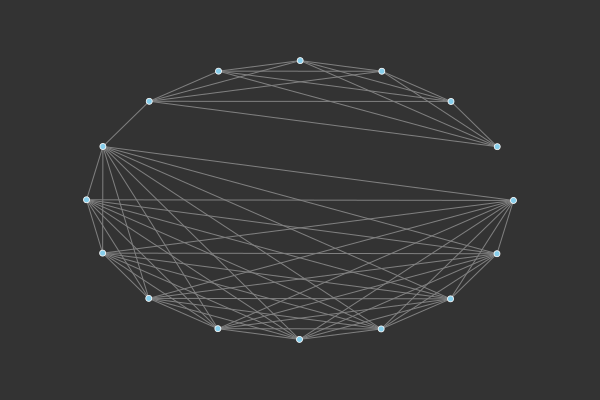
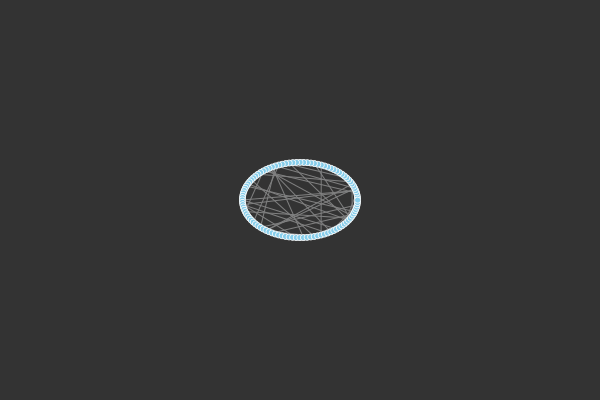
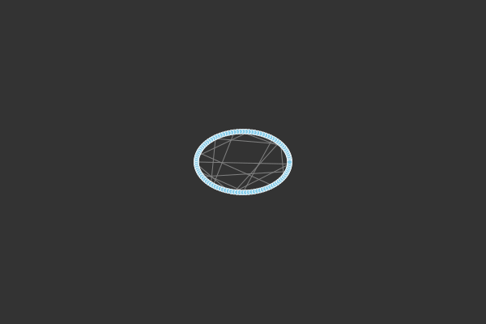

# spring-layout-julia
Implementation of Fruchterman-Reingold layout algorithm in Julia. 

The spring layout algorithm treats nodes as point masses and edges as springs. With each iteration of the algorithm a net force is computed on each node;  nearby disconnected nodes repulse each other and connected nodes experience a spring-like attraction. For details on the original algorithm by Fruchterman and Reingold checkout [this](https://doi.org/10.1002/spe.4380211102).

There are two significant changes in this implementation from the original paper. Instead of randomly scattering the nodes for an intial layout, this implementation places the nodes evenly along a unit circle. This change sees two benefits: computational speed up and reproducibility of results. Furthermore, there is no border applying inward force to the nodes. Although the lack of a border makes capturing the nodes in a scene more tedious, one will find that with some tinkering (or a large enough canvas) all the nodes can easily be captured. 

This repo contains both the source code for the julia implementation as well as a script for generating the following examples. 

&emsp;&emsp;&emsp;&emsp;

